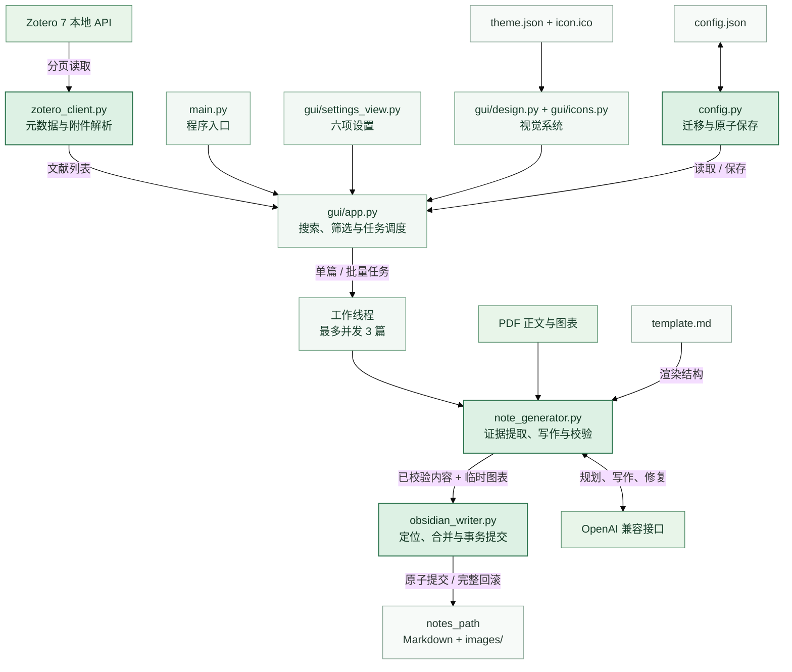

# ZotNotes — Zotero → Obsidian 论文精读笔记

ZotNotes 是一个 Windows 桌面工具：从正在运行的 Zotero 读取文献和 PDF，调用 OpenAI 兼容模型生成结构化 Markdown 精读笔记，再把笔记与图表整体写入指定的 Obsidian 笔记目录。

- 源码：<https://github.com/westriver-moon/ZOTERO-OBS>
- Windows 成品：<https://github.com/westriver-moon/ZOTERO-OBS/releases>
- 当前发行版：`v0.2.0-rc.2`

## 使用条件

1. Windows 10/11。
2. Zotero 7 正在运行，并允许本机其他程序通信。
3. 一个用于保存论文笔记的文件夹，可以是 Obsidian vault 内的任意目录。
4. OpenAI 兼容接口的 Base URL、API Key 和模型名。
5. Better BibTeX 可选；没有 citekey 时程序会生成稳定的兜底名称。

## 快速开始

1. 下载并运行 `ZotNotes.exe`，或按下文说明从源码启动。
2. 打开“设置”：
   - 选择最终的笔记输出文件夹；
   - 模板通常保持默认；
   - 填写模型接口地址、API Key 和模型名；
   - “研究领域 / 写作偏好”可留空。
3. 保存设置并刷新 Zotero 文献。
4. 搜索或筛选文献，单篇生成，或勾选当前列表后批量生成。
5. 已生成的文献可以直接重新生成；`## 我的笔记` 和 `## 疑问` 两个手写区会被保留。

主界面提供以下视图：

| 视图 | 内容 |
|---|---|
| 含 PDF | 默认视图，只显示带 PDF 附件的条目 |
| 全部 | 包括没有 PDF 的条目 |
| 未生成 | 尚无对应笔记的条目 |
| 需处理 | 需原文、仅摘要、需修复或上次生成失败的条目 |

“全选当前列表”只选择当前搜索与筛选结果。“PDF”按钮使用系统默认阅读器打开附件。批量生成最多并发处理 3 篇文献。

论文卡片的整块区域共享同一悬停状态；鼠标经过标题、状态、空白处或操作按钮时不会反复闪烁。批量任务失败时，界面会在汇总状态之外直接显示首个具体错误，便于定位问题。

## 状态含义

| 状态 | 含义 |
|---|---|
| 未生成 | 尚无对应笔记 |
| 已生成 | 笔记完整 |
| 仅摘要 | PDF 正文不可用，依据 Zotero 摘要生成 |
| 需原文 | PDF 正文和摘要都不可用，只生成证据不足骨架 |
| 需修复 | 已有笔记正文仍含占位内容，可重新生成 |
| 失败 | 本次模型调用、校验或文件提交失败，可重试 |

## 设置与配置

界面只保留六项设置：

| 字段 | 用途 |
|---|---|
| `notes_path` | 最终的论文笔记输出目录 |
| `template_path` | Markdown 模板；留空时使用程序目录的 `template.md` |
| `llm_base_url` | OpenAI 兼容接口地址 |
| `llm_api_key` | API Key |
| `llm_model` | 模型名称 |
| `llm_profile` | 研究领域或写作偏好；留空时使用通用学术研究者设定 |

Zotero 地址固定为 `http://127.0.0.1:23119/api/`；文献存在 PDF 时始终读取正文，不提供额外高级开关。

配置保存在源码目录或 `ZotNotes.exe` 同目录的 `config.json`。文件结构与 `config.example.json` 一致：

```json
{
  "notes_path": "",
  "template_path": "",
  "llm_base_url": "https://api.deepseek.com/v1",
  "llm_api_key": "",
  "llm_model": "deepseek-chat",
  "llm_profile": ""
}
```

旧版的 Vault 路径和笔记子目录会在读取时合并为 `notes_path`；保存一次设置后，只会写入上述六项。`config.json` 含明文 API Key，已被 `.gitignore` 排除，不要上传或分享个人配置。

## 生成与写入规则

```text
Zotero 本地 API
  → 文献、附件与 citekey
  → PDF 正文和图表提取
  → LLM 规划、写作、校验与一次修复
  → Markdown 和图片事务提交
  → Obsidian 笔记目录
```

证据不足时程序不会要求模型猜测：没有 PDF 正文但有摘要时标记为“仅摘要”；正文和摘要都没有时生成“需原文”骨架。模型生成内容经校验后最多修复一次；仍有问题则本次生成失败，不写入残缺结果。

笔记文件默认直接使用论文标题，例如 `Auto-Encoding Variational Bayes.md`。Windows 文件名中的非法字符会替换为连字符；只有论文标题与已有文件冲突时才追加 Zotero key。图片仍位于稳定的 `images/<安全 citekey>-<Zotero key>/`。程序根据 frontmatter 中的 `zotero_key` 定位已有笔记，因此用户可以在输出目录及其子目录中自由改名或移动笔记，重新生成不会把名称改回。若同一 Zotero key 对应多份笔记，程序会报告冲突，不会任选一份覆盖。

重新生成时，Markdown 和图片通过暂存、切换与回滚作为一个整体提交，避免新笔记与旧图片混用。任何图片缺失或提交失败都会撤销本次写入。

## 模板

顶部“模板”按钮使用系统默认编辑器打开当前模板。模板不存在时，程序会自动创建默认模板。

支持以下占位符：

```text
{{zotero:title}}       {{zotero:authors}}     {{zotero:year}}
{{zotero:doi}}         {{zotero:url}}         {{zotero:zotero_key}}
{{zotero:tags}}        {{zotero:pdf}}         {{zotero:item_type}}
{{zotero:note_file}}   {{zotero:llm}}
```

## 文件与资产位置

| 内容 | 位置 |
|---|---|
| 本地配置 | 源码目录或 exe 同目录的 `config.json` |
| 默认模板 | 源码目录或 exe 同目录的 `template.md` |
| 笔记 | `notes_path/<论文标题>.md`；同名冲突时追加 Zotero key，也可由用户改名或移入子目录 |
| 图片 | `notes_path/images/<safe-citekey>-<zotero-key>/` |
| 主题与图标 | `theme.json`、`icon.ico`；打包时内置，同目录文件可覆盖 |
| Zotero 数据源 | `http://127.0.0.1:23119/api/` |
| LLM | 设置中的 `llm_base_url` |

界面优先使用免费开源的 Noto Sans SC；系统没有该字体时由 Tk 使用系统字体替代。字体文件没有打进仓库或 exe。

## 当前架构



界面层只负责交互和任务编排；核心服务分别处理配置、Zotero、生成与写入。生成内容必须通过校验后才交给写入层，Markdown 与图片作为同一事务提交。

| 模块 | 职责 |
|---|---|
| `main.py` | GUI 入口 |
| `config.py` | 六项配置、旧配置迁移与原子保存 |
| `zotero_client.py` | Zotero 分页读取、元数据标准化与 PDF 路径解析 |
| `note_generator.py` | PDF/图表提取、模型调用、校验与模板渲染 |
| `obsidian_writer.py` | 笔记定位、手写区保留与整体事务提交 |
| `gui/app.py` | 主界面、筛选、单篇和批量任务 |
| `gui/settings_view.py` | 六项设置编辑 |
| `gui/design.py` | 颜色、字体、层级和状态样式 |
| `gui/icons.py` | 轻量界面图标 |
| `tests/` | 自动回归测试 |
| `ZotNotes.spec` | 单文件 Windows 打包配置 |

刷新在工作线程中分页读取 Zotero，同时递归扫描输出目录中的 Markdown；搜索和四种视图仅在本地改变显示。所有 Tk 控件更新经 UI 队列回到主线程，设置、刷新与生成不会同时执行状态性操作。

## 源码运行与测试

```powershell
py -m venv .venv
.\.venv\Scripts\Activate.ps1
python -m pip install -r requirements.txt
python main.py
```

运行完整测试：

```powershell
python -m pip install -r requirements-dev.txt
python -m pytest -p no:cacheprovider
```

## Windows 打包

请在只安装本项目依赖的隔离虚拟环境中打包，避免 Anaconda 等全局环境中的 PyQt/PySide 包被 PyInstaller 一并收集：

```powershell
py -m venv .venv-build
.\.venv-build\Scripts\Activate.ps1
python -m pip install -r requirements.txt -r requirements-dev.txt
python -m PyInstaller --clean --noconfirm ZotNotes.spec
```

产物为 `dist/ZotNotes.exe`。

## 常见问题

- 刷新失败：确认 Zotero 已启动并允许本机其他程序通信。
- 搜不到无 PDF 文献：切换为“全部”。
- 显示“需原文”：PDF 可能是扫描件或附件路径无效；补充可提取文本的 PDF 后重新生成。
- 生成失败：查看界面底部信息，确认模型地址、API Key 和网络后重试。
- 移动笔记后提示重复：输出目录及其子目录中存在相同 `zotero_key` 的多份 Markdown，需要人工只保留正确的一份。

## 许可证

本项目采用 MIT License，见 `LICENSE`。
