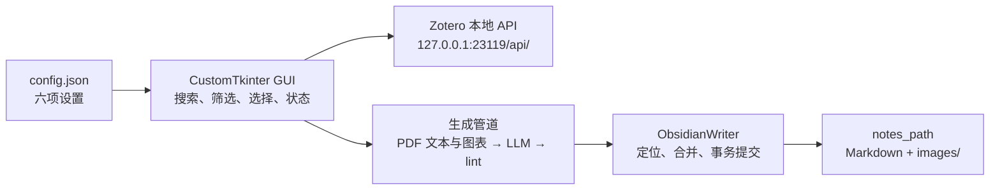
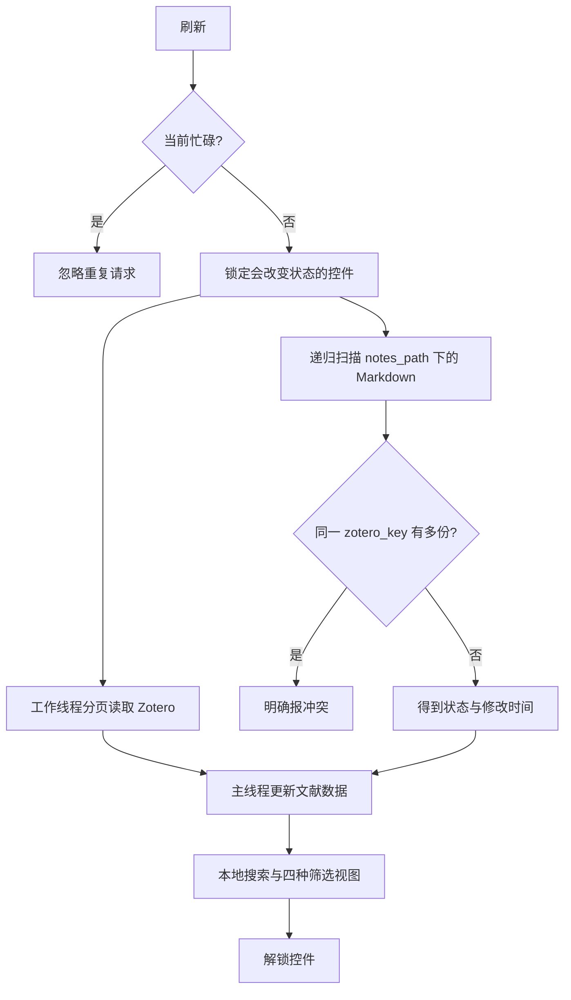
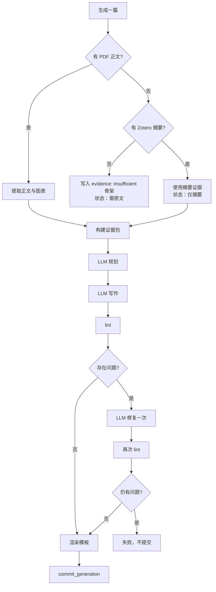
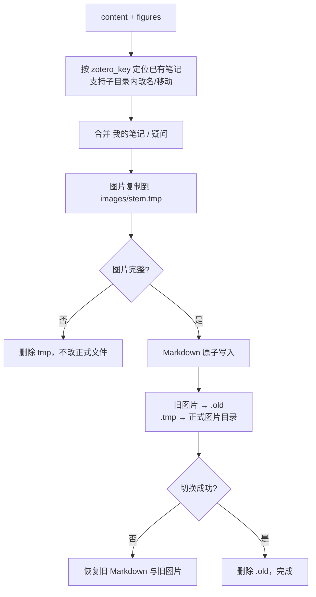

# ZotNotes 当前架构

## 总体数据流

## 刷新与筛选

刷新直接保存完整文献列表；“含 PDF / 全部 / 未生成 / 需处理”只改变 GUI 显示，不触发新的网络请求，也不需要配置开关。

## 生成管道

所有 lint 问题在修复后都视为失败条件；没有按问题类型再加一层复杂分支。

## 笔记与图片整体提交

## 模块职责

| 模块 | 单一职责 |
|---|---|
| `gui/app.py` | 展示、筛选、任务调度和线程安全 UI 更新 |
| `gui/settings_view.py` | 六项设置的编辑 |
| `zotero_client.py` | Zotero 分页读取、元数据标准化和 PDF 路径解析 |
| `note_generator.py` | 证据提取、模型调用、校验与模板渲染 |
| `obsidian_writer.py` | 笔记定位、手写区合并和事务提交 |
| `config.py` | 默认值、旧版迁移、过滤和原子保存 |

批量生成由一个工作线程管理 `ThreadPoolExecutor(max_workers=3)`；所有 Tk 控件更新通过 UI 队列回到主线程。设置、刷新和生成在同一时间只允许一个状态性操作，避免旧刷新结果覆盖新配置。
