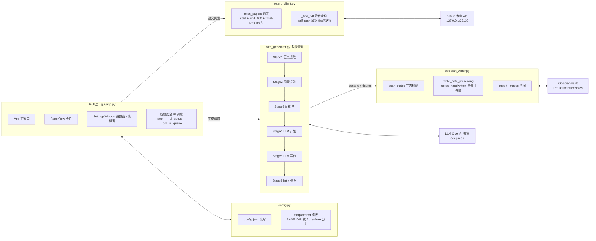
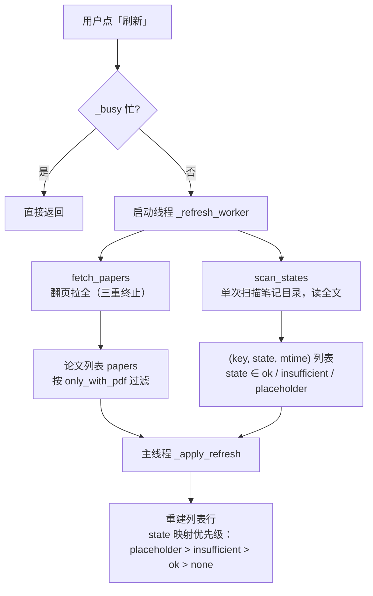
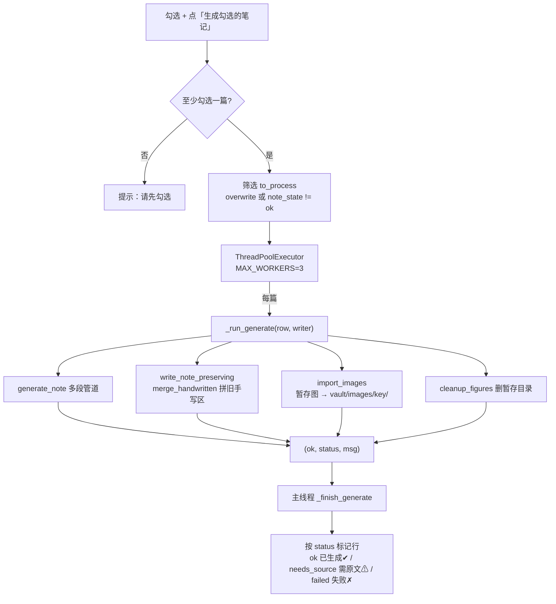
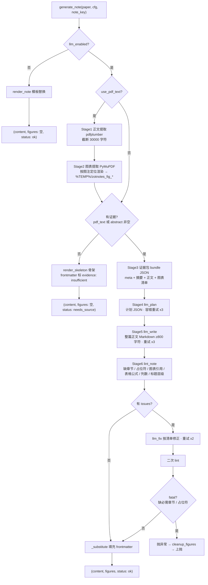
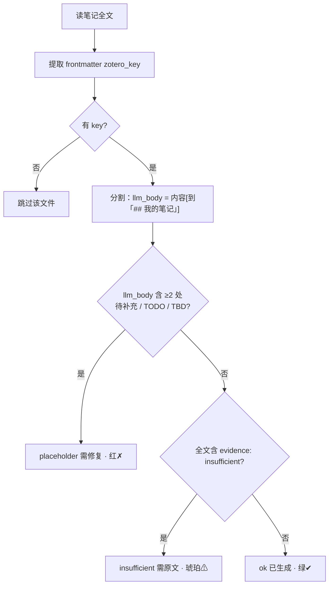

# ZotNotes 架构流程图

> 本图由源码绘制：`gui/app.py` + `note_generator.py` + `zotero_client.py` + `obsidian_writer.py` + `config.py`。
> Obsidian 中以代码块渲染（mermaid 原生支持）。

## 一、总体分层

## 二、刷新流程

## 三、生成流程（单篇 / 批量）

## 四、多段生成管道（generate_note 核心）

## 五、笔记三态检测（scan_states）

## 六、关键设计点

| 设计 | 说明 |
|---|---|
| 高内聚低耦合 | 管道是纯函数链（`generate_note` 不碰 GUI）；`merge_handwritten` 是纯函数，GUI 只换一行调用；`scan_states` 单次扫描，4 个查询方法都是它的派生 |
| 线程模型 | 所有 I/O（Zotero / LLM / 文件）在工作线程；UI 更新一律 `_post` 排队到主线程，避免 tkinter 跨线程崩溃 |
| fail-closed | 无证据不硬编：生成骨架 + 标记，GUI 显示「需原文」；补原文后可重试，不会被 overwrite 拦截 |
| 失败清理 | LLM 阶段异常 `cleanup_figures` 清暂存；成功路径由 GUI 拷贝完再清；空暂存目录当场删 |
| 覆盖保护 | 重新生成不覆盖手写：`write_note_preserving` 把旧笔记的「我的笔记 / 疑问」拼进新正文 |
